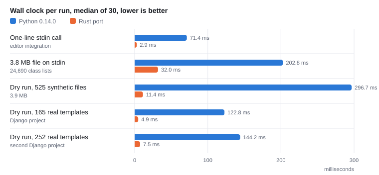
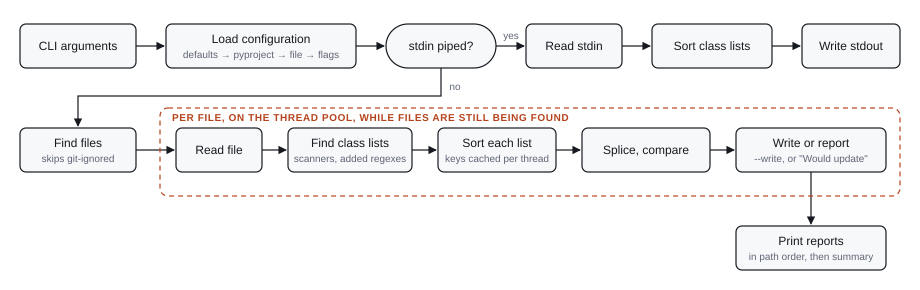
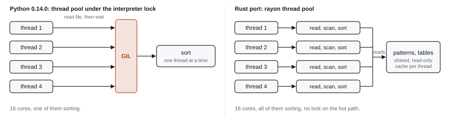

# tailwhip-rust

A Rust port of [tailwhip](https://github.com/bartTC/tailwhip), the Tailwind
CSS class sorter for HTML, CSS and template files, written to test one
question: how much faster can the same tool be in Rust?

**This repository exists for testing only.** It is an experiment, not a
release. There is no package, no versioning promise and no support. The
Python tool is the one to use.

The port sorts classes exactly like the Python tool: the output was the same
for every file it was tried on. Around the sort it does what is fastest
rather than what Python did. Directory walks skip hidden and git-ignored
files, class attributes are found without a regex engine, and only the
`[tool.tailwhip]` part of a `pyproject.toml` is read. The one-line stdin call
an editor makes on save takes 2.9 ms instead of 71 ms, and a dry run from the
root of a Django project 9 ms instead of 753.

```bash
$ cargo build --release
$ echo '<div class="p-4 m-2 bg-white">' | ./target/release/tailwhip
<div class="m-2 p-4 bg-white">

$ tailwhip templates/            # dry run: report files that would change
$ tailwhip templates/ --write    # sort in place
$ tailwhip templates/ -vv        # show a diff per file
$ tailwhip "static/**/*.{css,scss}" index.html
```

## Results

Measured on 4 October 2026 with `bench/compare.py` on an M3 Max with 16
cores: wall clock including process start, median of 30 runs, lower is
better. "Real templates" are two Django projects.

<picture>
  <source media="(prefers-color-scheme: dark)" srcset="docs/wall-clock-dark.svg">
  
</picture>

| Case                             | Python median | Python min | Rust median | Rust min | Speedup |
|----------------------------------|--------------:|-----------:|------------:|---------:|--------:|
| One-line stdin call              |       71.4 ms |    69.1 ms |      2.9 ms |   2.5 ms |   24.8x |
| 3.8 MB file on stdin             |      202.8 ms |   200.4 ms |     32.0 ms |  31.0 ms |    6.3x |
| Dry run, 525 synthetic files     |      296.7 ms |   291.0 ms |     11.4 ms |  10.2 ms |   26.1x |
| Dry run, 165 real templates      |      122.8 ms |   117.9 ms |      4.9 ms |   4.5 ms |   24.9x |
| Dry run, 252 real templates      |      144.2 ms |   139.8 ms |      7.5 ms |   6.8 ms |   19.3x |

The harness itself costs time: piping 7.6 MB through Python makes up most
of the 32 ms of the large file, which a Rust runner measures at 11.5 ms. For
the one-line call, the 2.9 ms are mostly the harness and process start; a
Rust runner measures 1.7 ms, of which 1.45 ms is what starting a Rust binary
that does nothing costs.

The cases above name the template directories. Run from the root of the
same two projects, `tailwhip .` is where the tools differ most, because the
Python tool also walks into `node_modules`, the virtualenv and the collected
static files, and would sort what it finds there:

| Project root (dry run)   | Files below | Python                  | Rust                  | Speedup |
|--------------------------|------------:|------------------------:|----------------------:|--------:|
| First Django project     |      21,880 |   359.5 ms on 471 files |   5.4 ms on 216 files |     67x |
| Second Django project    |      45,329 | 753.2 ms on 1,245 files |   9.3 ms on 280 files |     81x |

### Same output

Every file was piped through both tools and the outputs compared byte for
byte. Nothing differed, 0 mismatches in 942 files:

- **525 synthetic files** (3.9 MB): Django-style templates built from the
  87 hand-ordered class groups of the Python test suite, shuffled, with
  template expressions, single and double quotes, multi-line attributes and
  `@apply` rules.
- **165 real templates** from a Django project.
- **252 real templates** from a second Django project.

The Rust test suite adds 102 tests, including the 87 golden groups under
reversal, every rotation and 25 random shuffles each, and the built-in class
finders against the regexes they replace on 20,000 random inputs.

## How a run works

<picture>
  <source media="(prefers-color-scheme: dark)" srcset="docs/workflow-dark.svg">
  
</picture>

The stdin branch runs the same three stages as a file (find class lists,
sort each list, splice) on one thread. Class attributes and `@apply` rules
are found by hand-written scanners, which match exactly what the Python
tool's regexes match; a regex engine is only built for patterns a project
adds. The dashed region is where the thread pool works: directories are read
in parallel, skipping hidden and git-ignored entries, and every file is
processed in a task of its own as soon as it is found, so walking the tree
and sorting overlap. A file with at least 256 class lists sorts them on the
pool as well. What each file has to report is collected and printed at the
end, in path order, with one write.

Sorting a list means splitting it on whitespace, parsing each class into
variants, prefix and components, ranking those by their position in the
configured lists, sorting, dropping duplicates and joining. Each thread
keeps the key of every class it has parsed, written as bytes that compare
the way the key does, so a class is parsed once per thread and a list is
sorted by comparing bytes.

## Threads in Python and in Rust

Both tools use a thread pool. The difference is what the threads are allowed
to do at the same time.

<picture>
  <source media="(prefers-color-scheme: dark)" srcset="docs/threads-dark.svg">
  
</picture>

Python's lock is released while a thread waits for the disk, so file reads
overlap, but the sort is Python bytecode and runs under the lock, one thread
at a time. Rust threads run native code with no such lock; they share the
compiled patterns and lookup tables by reference and each keeps its own
cache of sorted lists.

|                       | Python 0.14.0                                              | Rust port                                                                           |
|-----------------------|------------------------------------------------------------|-------------------------------------------------------------------------------------|
| Workers               | `ThreadPoolExecutor`, up to 32 threads                     | `rayon` pool: six threads for files, one per core for a large stdin input           |
| Runs in parallel      | File reads and writes. The sort holds the interpreter lock | Walking directories, reading, scanning and sorting, all of it                       |
| Shared state          | Configuration and the result cache, guarded by the lock    | Patterns and tables, read-only. Caches per thread, so no lock is taken              |
| Within one file       | Sequential                                                 | Class lists sorted on the pool once a file has 256 or more                          |
| Pool start            | Every run, including stdin                                 | Only when there is enough work. The one-line stdin call never starts it             |
| 525 files, measured   | 284 ms. More cores do not help                             | 25 to 32 ms on one thread, 5.5 ms on six                                            |

Six threads, not sixteen, because most of the work in a real project is
reading directories and files, and on macOS that gets slower with more
threads: 252 templates read in 1.3 ms on six threads, 4 ms on sixteen and
3.5 ms on one. The second Django project, 252 templates in a tree of 5,125
files, takes 7 ms on six threads and 12 ms on sixteen. Only the synthetic
corpus, which is all templates, gains from more threads, about 1.5 ms.
`RAYON_NUM_THREADS` overrides the limit.

Neither tool uses processes. Processes would have been the Python way around
the lock, but on macOS each worker process starts by importing the tool
again, about 60 ms per worker, and every result travels back through
pickling. For a job that takes 100 ms in total that is a loss. Rust does not
need the workaround: threads get full parallelism and shared memory for free.

## Where the time goes

**The one-line call**

1. Python spends nearly all of its 71 ms importing dependencies before
   reading stdin.
2. The Rust binary spends about 0.25 ms of its own. Nothing is compiled or
   parsed at start: the default configuration is Rust code generated by
   `build.rs` from `configuration.toml`, the class finders need no regex,
   and of a `pyproject.toml` only the `[tool.tailwhip]` part is parsed.
3. The rest is process start, 1.45 ms for a Rust binary that does nothing.

**The 3.8 MB file**

1. Processing takes 7 ms: 2.9 ms to find the class lists on one thread, the
   rest sorting 24,690 of them on all cores.
2. The rest of the measured 32 ms is piping 7.6 MB in and out through the
   harness, which the Python tool pays too.
3. Python caches sorted attribute values, which is why it stays within 6x on
   repetitive input.

## What the port changed to get here

Processing time of the same 2.3 MB file at each step:

| Time   | Step |
|-------:|------|
| 82 ms  | First port, a literal translation. The HTML pattern used a backreference for the quote character, which needs a backtracking regex engine, and that scan alone took 52 ms. |
| 46 ms  | Patterns rewritten for the linear-time `regex` crate: double and single quotes are two patterns, and the sorted classes are spliced into the matched span instead of rebuilt from a template. |
| 34 ms  | Single-pass byte-level class parser that keeps the list positions it finds, so building a sort key needs no second lookup. Unicode word boundaries replaced by ASCII ones, three times cheaper to scan. |
| 29 ms* | Class lists of a large input sorted on all cores; results cached per thread. Directory discovery stopped resolving every path through the file system, which was 25 µs per file. *Measured on the 3.8 MB file. |

A second round looked at the workflow as a whole rather than at the sort:

| Change | Effect |
|--------|--------|
| The `classes` group is found without a capture engine. In `class="(?P<classes>[^"]*)"` the group can contain no quote, so it ends one byte before the match and starts after the last quote before that; only the end of each match is searched for. Checked on the regex's syntax tree when a pattern is compiled; other patterns use captures as before. | Regex scans of the 3.8 MB file: 17.6 to 7.8 ms |
| Sort keys are cached per thread, as bytes that compare like the key, and a list is sorted as 4-byte ids into that cache. Before, every class was parsed again, with 5 to 6 hash lookups, and 340-byte keys were moved around while sorting. | Sorting: 155 to 65 ns per class |
| Directories are read in parallel, and each file is processed as soon as it is found instead of after the whole tree was walked. File mode uses six threads. | 252 real templates in a tree of 5,125 files: 18 to 8 ms |
| Every file's report is collected and printed once, in path order. Before, each line took the stdout lock, a system call, and came out in whatever order threads finished. | Deterministic output |
| The default configuration is compiled into the binary by `build.rs`, and the regexes are built with `regex-automata` directly, without the engines a delimited group does not need. | One-line call: 2.12 to 2.03 ms |
| Each thread keeps its own regex scratch space, instead of taking it from a pool shared by all threads on every match. | Scans on 16 threads at once: twice as fast |

Tried and dropped, because they did not pay: compiling the patterns on
several threads (each compile took two to four times as long), a separate
pool for file system work next to one for sorting (waking threads across
pools cost more than it saved), mimalloc (no change), and scoping `(?i)` to
the literal part of the patterns (no change in compile time).

A third round dropped what only mimicked the Python tool. Only the sort
order had to stay the same:

| Change | Effect |
|--------|--------|
| Directory walks skip hidden files and what `.gitignore` files exclude, like ripgrep; files named on the command line are always processed, and `--no-ignore` walks everything. The Python tool found files with `wcmatch` and its `DOTGLOB` flag. | Root of a Django project: 69 to 7 ms, and nothing in `.venv` is touched |
| `class="..."`, `class='...'` and `@apply` are found by hand-written scanners instead of regexes. They match exactly what the regexes matched, Unicode whitespace and the `ſ` that `(?i)` accepts for `s` included; a test compares them on random input. `class_patterns` now adds regexes for other syntaxes rather than replacing the built-in patterns. | No regex is compiled for the defaults; scans of the 3.8 MB file: 7.8 to 2.9 ms |
| Only the `[tool.tailwhip]` section of a `pyproject.toml` is parsed, and a file that never uses `tailwhip` as a key is not parsed at all. | 180 to 80 µs per start in a project with a 10 KB `pyproject.toml` |
| The default lists are borrowed from the binary instead of copied into 600 strings, and the sorter's tables are built without formatting strings or growing maps. | 0.1 ms per start |
| The command line is parsed by `lexopt` and a short hand-written parser instead of clap, which built its whole model of the command line on every start. | 260 KB smaller binary, 20 µs per start |

Together: the one-line call went from 2.12 to 1.7 ms measured by a Rust
runner, and the tool's own share of it from 0.68 to 0.25 ms.

## Same sort, different everything else

Classes are sorted exactly like the Python tool sorts them. Everything around
the sort was free to change, and these details differ on purpose:

- **Directories are walked like ripgrep walks them.** Hidden files and
  directories are skipped, and so is what `.gitignore` files in a Git
  repository exclude. Files named on the command line are always processed;
  `--no-ignore` walks everything, as the Python tool did.
- **HTML class attributes and `@apply` rules are built in, and
  `class_patterns` adds to them.** A configured pattern is a regex with a
  `classes` group, no template, in the syntax of the Rust `regex` crate:
  backreferences and lookaround are not supported. Only that group's text
  is replaced. Quotes, spacing and letter case around it stay as written,
  where Python normalized `class = "x"` to `class="x"`.
- **The command line has the same flags plus `--no-ignore`**, but its own
  help text and error messages. Usage errors exit with code 2.
- **`pyproject.toml` is looked for from the files being processed**, so
  `tailwhip ../other-project/` uses that project's settings. The Python tool
  looked from the current directory, which stdin still does.
- **Configuration-file values for `verbosity` and `write_mode` are
  honored.** Python always overrode them with the command line defaults.
- **Errors go to stderr** and are still shown with `--quiet`.
- **Line endings and byte order marks are preserved.** Python rewrote CRLF
  files as LF.
- **Reported paths are absolute** but symbolic links are not resolved.
- **Files are reported in path order**, all at once when the run ends.
  Python printed each file as its thread finished.
- Invalid UTF-8 on stdin is passed through unchanged with exit code 1
  instead of a traceback.
- Not supported: `TAILWHIP_*` environment variables (undocumented Dynaconf
  behavior) and extended glob syntax such as `@(a|b)`.

## Configuration

Settings are loaded in this order, later sources overriding earlier ones,
and every key replaces its default as a whole. `class_patterns` is empty by
default, so setting it only adds patterns to the built-in ones:

1. the built-in defaults in `configuration.toml`, embedded in the binary
2. the `[tool.tailwhip]` section of the nearest `pyproject.toml`, looked for
   from the deepest directory that contains all the paths given, or from the
   current directory for stdin
3. a file passed with `--configuration FILE`
4. command line flags

`configuration.toml` documents every key: output settings, file globs,
template expressions to skip, the ordered lists that define the sort order,
and how to add class patterns.

## Reproduce

```bash
cd tailwhip-rust
cargo build --release
python3 bench/compare.py --runs 30 --files 500 path/to/templates ...
```

The harness generates the synthetic corpus, checks conformance for every
file, then times both tools. It expects the Python tool's virtualenv in a
sibling `tailwhip` directory. `bench/graphs.py` writes the graphs above to
`docs/` from the measured numbers.

```bash
cargo test                      # unit, integration and doc tests
cargo clippy --all-targets
cargo run --release --example profile -- bench/big.html      # stage timings
cargo run --release --example profile_dir -- bench/corpus    # file mode timings
cargo run --release --example sort_loop -- 4 bench/corpus/*.html  # cost per class
```

## License

MIT, see `LICENSE`.
